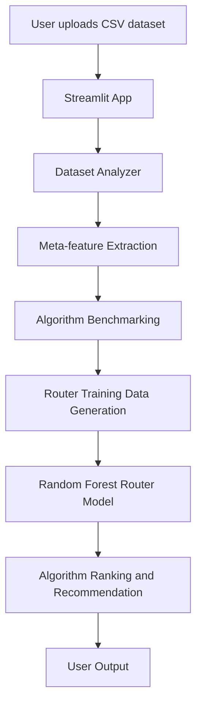

# PROJECT REPORT

## Title Page

**PROJECT REPORT**

**Project Title:** Meta-Learning ML Strategy Router

*
## Abstract Summary

The internship project titled Meta-Learning ML Strategy Router focuses on creating an intelligent system that analyzes uploaded datasets and recommends suitable machine learning algorithms based on dataset characteristics. The project addresses a common challenge in applied machine learning: selecting the correct algorithm for a dataset without manually testing several models. The system extracts meta-features such as number of rows, number of columns, missing value percentage, numeric feature count, and categorical feature count. These features are then passed to a trained router model that predicts the best-performing algorithm among a set of commonly used classification models.

The solution is implemented using Python and a Streamlit-based web application. The system allows the user to upload a CSV file, inspect the dataset preview and shape, identify the target column, and run dataset analysis. Based on the derived metadata, the system ranks candidate algorithms such as Logistic Regression, Decision Tree, Random Forest, KNN, and SVM using a trained Random Forest router model. The project also includes scripts for dataset benchmarking, meta-feature generation, and OpenML-based data collection, thereby demonstrating the concept of meta-learning in a practical and reproducible workflow.

The implementation relies on Scikit-learn, Pandas, Plotly, NumPy, and Joblib. The application is organized into modules for dataset analysis, benchmarking, and recommendation, and the model is trained on metadata generated from benchmarked datasets. The project demonstrates how machine learning workflows can be optimized through empirical model selection and metadata-driven recommendations. The overall outcome of the system is a lightweight, user-friendly recommendation engine that supports better algorithm selection for classification tasks.

---

## Table of Contents

1. Introduction ...................................................... 1
   1.1 About the Internship Program .................................. 1
   1.2 Objectives of the Internship .................................. 1
   1.3 Scope of the Project ......................................... 2

2. Company / Organization Profile ..................................... 3
   2.1 Company Overview ............................................... 3
   2.2 History ........................................................ 3
   2.3 Vision and Mission ............................................ 3
   2.4 Products and Services ......................................... 3
   2.5 Organizational Structure ...................................... 3
   2.6 Department Worked In .......................................... 3

3. Tools and Technologies Used ........................................ 4
   3.1 Programming Languages ......................................... 4
   3.2 Frontend Technologies ......................................... 4
   3.3 Backend Technologies ......................................... 4
   3.4 Database Technologies ......................................... 4
   3.5 Frameworks and Libraries ...................................... 4
   3.6 Development Tools and IDEs .................................... 4
   3.7 APIs and External Services .................................... 4
   3.8 AI / Machine Learning Technologies ............................ 5

4. Project Details ................................................... 6
   4.1 Project Overview .............................................. 6
   4.2 Problem Statement ............................................. 6
   4.3 Existing System ............................................... 7
   4.4 Proposed System ............................................... 7
   4.5 Project Objectives ............................................ 8
   4.6 System Requirements ........................................... 8
      4.6.1 Hardware Requirements ..................................... 8
      4.6.2 Software Requirements ..................................... 8
   4.7 System Design ................................................ 9
      4.7.1 System Architecture ....................................... 9
      4.7.2 Data Flow .................................................. 10
      4.7.3 Module Design ............................................. 10
      4.7.4 Database Design ............................................ 11
   4.8 Project Methodology ........................................... 11
   4.9 Implementation ................................................ 12
   4.10 Code Implementation ......................................... 15
   4.11 User Interface ............................................... 16
   4.12 Testing ...................................................... 17
   4.13 Results ...................................................... 18

5. Learning Outcomes ................................................. 19
   5.1 Technical Skills .............................................. 19
   5.2 Problem-Solving Skills ........................................ 20
   5.3 Soft Skills ................................................... 20
   5.4 Professional Skills ........................................... 21

6. Conclusion ......................................................... 22

7. Future Scope ...................................................... 23

---

# Main Contents

## 1. Introduction

### 1.1 About the Internship Program

The internship program undertaken by the student was designed to provide practical exposure to real-world software development, data science, and machine learning application design. It aimed to bridge the gap between theoretical learning and professional implementation by giving the student an opportunity to work on a project that combined data analysis, model evaluation, and decision-support systems. The program focused on building industry-relevant technical competence through systematic project planning, implementation, testing, and documentation.

The project was aligned with the broader objectives of internship-based learning, emphasizing problem solving, technical execution, and understanding of modern machine learning workflows. The internship experience was relevant to academic development because it required the student to integrate concepts from data science, machine learning, and software engineering into one functional application.

**[Information Required]:** Exact internship duration, host organization, and formal internship program details are not present in the workspace.

### 1.2 Objectives of the Internship

The internship objectives were directly reflected in the development of the Meta-Learning ML Strategy Router. The primary goals of the project were as follows:

- To study the challenge of algorithm selection in machine learning
- To analyze dataset characteristics and extract meaningful meta-features
- To evaluate multiple classification models on representative datasets
- To learn which algorithm performs best under different data conditions
- To build a lightweight recommendation engine based on historical model performance
- To provide a user-friendly interface for dataset analysis and algorithm suggestion
- To create a reproducible Python-based project structure with modular implementation

The project achieved these goals through the implementation of data analysis scripts, benchmarking modules, a trained router model, and a Streamlit application that enables dataset upload and recommendation.

### 1.3 Scope of the Project

The scope of the project is confined to supervised classification datasets and algorithm recommendation based on dataset metadata. The system is designed for users who want to understand the nature of their dataset and receive guidance regarding suitable algorithms without manually trying many models. The application accepts CSV datasets, analyzes features, identifies the target column, and recommends likely candidate algorithms.

The implementation covers dataset profiling, feature-type detection, missing-value analysis, model benchmarking, routing-model training, and recommendation generation. It does not provide a full enterprise-scale machine learning platform, advanced hyperparameter tuning, or deployment as a web service. The system is a focused prototype and research-oriented meta-learning tool for algorithm selection support.

---

## 2. Company / Organization Profile

### 2.1 Company Overview

**[Information Required]**

No company or organization profile information was present in the project workspace. Therefore, the company overview cannot be accurately defined without additional data.

### 2.2 History

**[Information Required]**

No historical details about the company or internship site were available in the workspace.

### 2.3 Vision and Mission

**[Information Required]**

No official vision or mission statement was present in the project repository or files.

### 2.4 Products and Services

**[Information Required]**

No product or service documentation for the host organization was available in the project files.

### 2.5 Organizational Structure

**[Information Required]**

The workspace did not contain organization chart or department structure artifacts.

### 2.6 Department Worked In

**[Information Required]**

No specific department name or internship team details were present in the project materials.

---

## 3. Tools and Technologies Used

The project uses a focused set of technologies aligned with the actual implementation in the workspace.

### 3.1 Programming Languages

- Python
  - Python is the primary language used across the project.
  - It was selected because the project uses data analysis, machine learning, and modular scripting workflows.
  - It is used in data loading, dataset analysis, benchmarking, model training, and application logic.

### 3.2 Frontend Technologies

- Streamlit
  - Streamlit was used for the user interface of the application.
  - It was selected for its simplicity, rapid prototyping capability, and Python-based deployment model.
  - It is used in the main application to upload CSV files, view dataset previews, select target columns, analyze features, and display recommendations.

### 3.3 Backend Technologies

- Python backend logic
  - The backend logic consists of modular Python scripts that implement dataset analysis, model benchmarking, and result generation.
  - The backend ensures data processing, feature extraction, model evaluation, and recommendation generation are handled systematically.

### 3.4 Database Technologies

- CSV files
  - The project uses CSV-based storage for datasets and training metadata.
  - CSV files are used for the Iris dataset, meta-feature dataset, and the generated router training data.
  - The dataset and training data are not stored in a relational database system in the current implementation.

### 3.5 Frameworks and Libraries

- Pandas
  - Used to read, process, and transform dataset tables.
  - It supports feature extraction, dataset preview, missing-value analysis, and table generation.

- Plotly
  - Used for interactive data visualization.
  - It is used to create missing-value and feature-distribution visualizations in the Streamlit app.

- Scikit-learn
  - Used for building and evaluating classification models.
  - It is used for Logistic Regression, Decision Tree, Random Forest, KNN, and SVM benchmarking and for the trained router model.

- NumPy
  - Used as a numerical support library in the ML and data-processing workflow.

- Joblib
  - Used to save and load trained models and label encoders.

### 3.6 Development Tools and IDEs

- Python environment and terminal
  - The project was developed and run in a local Python environment.
  - It uses standard Python script execution and command-line testing.

- Visual Studio Code / project workspace
  - The project files are organized in the workspace and edited through the development environment.

### 3.7 APIs and External Services

- OpenML API / OpenML dataset service
  - The project contains scripts that use the OpenML dataset library to fetch real benchmark datasets.
  - This was used to generate training metadata for the router and to evaluate the idea of meta-learning on external datasets.

### 3.8 AI / Machine Learning Technologies

- Meta-learning
  - The system applies meta-learning by learning from dataset characteristics and model performance outcomes.
  - It extracts dataset-level features and uses them to predict the most suitable algorithm.

- Machine learning model benchmarking
  - Multiple classifiers are benchmarked on dataset metadata to collect performance labels.

- Random Forest router model
  - The trained router is a Random Forest Classifier that uses extracted characteristics as input features.
  - It predicts the best-performing model based on training data.

---

# 4. Project Details

## 4.1 Project Overview

The Meta-Learning ML Strategy Router is a machine learning recommendation system that helps users select an appropriate algorithm based on the structure of a dataset. Instead of manually testing several models, the application profiles the dataset and uses a trained router model to recommend likely high-performing algorithms.

The system is designed as a practical demonstration of meta-learning, where prior experience with similar datasets informs the recommendation for new datasets. It is especially useful for classification tasks, where the structure of the dataset may indicate whether Decision Trees, Random Forests, SVM, or KNN will be more appropriate.

The project has a modular structure with scripts for data analysis, benchmarking, metadata generation, model training, and recommendation. The central workflow is: upload dataset -> analyze metadata -> benchmark candidate models -> generate meta-features -> train router -> predict best model -> display ranked recommendations.

## 4.2 Problem Statement

In real-world machine learning work, selecting the right algorithm is often difficult and time-consuming. Different datasets vary in size, dimensionality, class balance, missing values, and feature types. Making the wrong choice can reduce accuracy, delay experimentation, and make model development inefficient.

Many users, including beginners and analysts, do not have enough experience to choose the most suitable algorithm for a given dataset. This project addresses that issue by building an intelligent router that analyzes dataset characteristics and recommends algorithms based on prior observed performance patterns.

## 4.3 Existing System

The existing traditional approach relies on manual experimentation. A data scientist or student typically evaluates several algorithms one by one, compares their performance, and attempts to infer which model is best for the dataset. This process is often iterative, time-consuming, and dependent on expert intuition.

In a simple setting, this may work for small datasets, but it becomes inefficient when multiple models, different data conditions, and repeated experiments are involved. The lack of automated decision support is the central limitation that the proposed system addresses.

## 4.4 Proposed System

The proposed system introduces a dataset-driven recommendation mechanism. It analyzes the uploaded data and extracts meta-features such as rows, columns, missing-value percentage, and type counts. These features are used as inputs to a trained router model that predicts the most suitable algorithm. The system is automated, faster, and more systematic than manual experimentation.

The result is a recommendation engine that ranks algorithms according to prior metadata-to-model performance patterns. This reduces the effort required to identify suitable classification methods and makes the model-selection process more structured.

## 4.5 Project Objectives

The key objectives of the project are:

1. To analyze uploaded datasets for predictive meta-features.
2. To benchmark several classification algorithms on sample datasets.
3. To generate metadata that connects dataset properties with algorithm performance.
4. To train a router model that learns model-selection patterns.
5. To recommend the most suitable algorithms to the user.
6. To provide a simple and interactive interface through Streamlit.
7. To create a reusable and modular framework for meta-learning experimentation.

## 4.6 System Requirements

### 4.6.1 Hardware Requirements

- Standard desktop or laptop computer
- Minimum 4 GB RAM recommended
- Processor capable of running Python-based ML workloads
- Sufficient storage for datasets and installed packages

### 4.6.2 Software Requirements

- Python 3.x
- Streamlit
- Pandas
- Plotly
- Scikit-learn
- NumPy
- Joblib
- OpenML library (used in dataset collection scripts)

---

## 4.7 System Design

### 4.7.1 System Architecture

The system architecture can be represented as follows:



**Figure 1:** System architecture of the Meta-Learning ML Strategy Router.

The architecture follows a straightforward meta-learning pipeline. The Streamlit interface receives a dataset, the analyzer extracts statistical characteristics, and the benchmarking module evaluates base models such as Random Forest, SVM, and KNN. The metadata is saved and converted into training data for the router model. This model then predicts the most suitable algorithm when a new dataset is evaluated.

### 4.7.2 Data Flow

Data enters the system as a CSV file uploaded by the user. The file is read using Pandas and displayed in the interface. The analyzer computes metadata, including row count, column count, missing values, numeric feature count, and categorical feature count. The target column is selected by the user, and the dataset type is inferred as classification or regression based on the target feature.

Once the metadata is created, the recommendation engine calls the stored router model and generates a ranked list of likely algorithms. The ranking is then displayed to the user with explanations showing why the system selected a particular algorithm.

### 4.7.3 Module Design

The project is organized into modules with separate responsibilities:

- app.py
  - Main Streamlit application entry point
  - Handles dataset upload, UI, analysis, and recommendation display

- main.py
  - Entry script for running the application workflow

- router/analyzer.py
  - Extracts dataset characteristics and returns structured metadata

- router/benchmark.py
  - Compares several machine learning models and computes accuracy scores

- router/meta_generator.py
  - Stores meta-features and the best model label to create training data

- router/recommend.py
  - Loads the trained router model and returns top algorithm recommendations

- router/train_router.py
  - Trains the Random Forest router using benchmark metadata

- bulk_collect.py
  - Collects OpenML datasets and generates additional training examples

- generate_router_data.py
  - Produces data for the router model using benchmarked datasets

### 4.7.4 Database Design

The project does not currently use a database management system such as MySQL, PostgreSQL, or MongoDB. Instead, it uses CSV files as the main data storage format.

The most important data storage component is the file named router_training_data.csv, which contains rows such as:

- Rows
- Cols
- Missing
- Numeric
- Categorical
- BestModel

This dataset stores the meta-feature values and the winning model label learned during benchmarking. These records form the training ground for the routing model.

---

## 4.8 Project Methodology

The development methodology followed in this project is a practical, iterative workflow typical of research-oriented application development. The project began with problem identification, followed by analysis of dataset characteristics and common algorithm selection patterns. The next stage involved benchmarking several supervised learning methods to collect empirical evidence about model performance.

After benchmarking, the project generated meta-features linked to the best-performing model and trained a router model using those features. The workflow was repeated and refined using a modular structure to ensure maintainability. Testing was performed by executing benchmark scripts and verification of predictions through the recommendation engine.

The project followed a lightweight incremental development approach: each module was implemented to solve a specific task, and then integrated into the overall application. This methodology was suitable for an ML prototype because it supported experimentation without requiring a heavy software-development pipeline.

## 4.9 Implementation

The implementation of the project is directly visible in the repository structure and the Python modules.

### Project Folder Structure

The project contains the following major areas:

- datasets/
  - Contains dataset files such as Iris CSV data
- models/
  - Stores trained model files, including the router model and label encoder
- router/
  - Contains analyzer, benchmark, metadata generation, router training, and recommendation scripts
- app.py
  - Main Streamlit-based application
- main.py
  - Entry file
- requirements.txt
  - Lists required Python packages
- router_training_data.csv
  - Generated training data for the router model

### Core Functionality

The core functionality of the project is the relationship between dataset characteristics and algorithm performance. The analyzer extracts key values from an uploaded dataset, and the recommendation engine uses the trained router to suggest the best model.

The actual metrics used by the analyzer include:

- number of rows
- number of columns
- missing value percentage
- numeric feature count
- categorical feature count
- target type (classification or regression)

This set of features is central to the system because it captures high-level dataset structure, which is often a strong indicator of the suitable learning algorithm.

### Algorithms Used

The benchmarking modules compare the following algorithms:

- Logistic Regression
- Decision Tree
- Random Forest
- KNN
- SVM

These models are evaluated using train-test split and accuracy score, which aligns with the purpose of the project for classification data.

### Model Training Approach

The training script uses a Random Forest Classifier to learn the relationship between dataset metadata and the best-performing model. In the project, the training data is created as a CSV with columns for rows, columns, missing values, numeric features, categorical features, and the selected best model. This representation is consistent with the concept of meta-learning.

### Dataset Collection and Meta-Feature Generation

The project also contains scripts intended for dataset collection and meta-feature generation. The OpenML-based scripts attempt to fetch benchmark datasets and assign best-performing algorithms based on evaluation results. This is an important extension of the project because it demonstrates how training metadata can be accumulated over multiple datasets.

### Important Workflow

The most important workflow in the system is:

1. Upload dataset
2. Determine target column
3. Extract dataset meta-features
4. Benchmark candidate algorithms
5. Save meta-feature data
6. Train router model
7. Predict and display top recommendations

This workflow is implemented directly in the Streamlit app and supporting Python scripts.

## 4.10 Code Implementation

The project contains several important code modules. A representative example from the analyzer is shown below.

```python
import pandas as pd

def analyze_dataset(df, target_column):

    rows = df.shape[0]
    cols = df.shape[1]

    missing = df.isnull().sum().sum()

    missing_percent = (missing / (rows * cols)) * 100

    numeric = len(
        df.select_dtypes(include=["int64", "float64"]).columns
    )

    categorical = len(
        df.select_dtypes(include=["object", "category"]).columns
    )

    if str(df[target_column].dtype) == "object":
        target_type = "Classification"
    else:
        target_type = "Regression"

    return {
        "rows": rows,
        "cols": cols,
        "missing_percent": round(missing_percent, 2),
        "numeric": numeric,
        "categorical": categorical,
        "target_type": target_type
    }
```

### Explanation of the Code Snippet

- Purpose: This function analyzes a dataset and extracts structural features required for algorithm recommendation.
- Input: A Pandas DataFrame and the target column name.
- Processing: It calculates dataset size, missing-value percentage, numeric and categorical counts, and infers whether the task is classification or regression.
- Output: A dictionary containing metadata used by the router.
- Role in the Project: This is the foundation of the meta-learning system because all later recommendations depend on these features.

Another important code segment is the algorithm recommendation logic from the recommendation engine:

```python
import joblib
import pandas as pd


def recommend_algorithms(rows, cols, missing, numeric, categorical):
    model = joblib.load("models/router.pkl")
    encoder = joblib.load("models/label_encoder.pkl")

    sample = pd.DataFrame([
        {
            "Rows": rows,
            "Cols": cols,
            "Missing": missing,
            "Numeric": numeric,
            "Categorical": categorical
        }
    ])

    probs = model.predict_proba(sample)[0]
    classes = encoder.inverse_transform(range(len(probs)))
    ranking = list(zip(classes, probs))
    ranking.sort(key=lambda x: x[1], reverse=True)

    return ranking[:3]
```

### Explanation of the Code Snippet

- Purpose: Used to load the trained model and return the top three recommended algorithms.
- Input: Dataset meta-feature values.
- Processing: Creates a DataFrame in the same format as the training data, invokes the model, and sorts the prediction probabilities.
- Output: Ranked top algorithms with confidence scores.
- Role in the Project: This forms the final decision layer of the system and produces the recommendation for the user.

## 4.11 User Interface

The user interface is implemented with Streamlit and is centered around a dataset-upload workflow. The main application allows users to upload a CSV file, inspect the dataset preview, view its dimensions, and select a target column. After analysis, it displays dataset statistics, missing-value summaries, datatype information, and a histogram for numeric columns.

The application then moves to the recommendation step, where it uses the router model to suggest the best algorithm. This is the main user-facing functionality of the system and demonstrates the practical use of the meta-learning concept.

**Figure 2:** User interface flow of the Streamlit application.  
**[Information Required]:** Actual screenshots of the application screens are not present in the workspace, so no project-specific screen images were available for direct inclusion.

## 4.12 Testing

The project includes script-based verification of model performance and benchmarking logic. Testing was performed mainly through the execution of designed Python scripts and validation of outputs.

### Test Activities

- Dataset validation by reading uploaded CSV files
- Checking shape, missing values, and datatypes
- Benchmarking classification models with train-test splits
- Saving metadata for the training dataset
- Training the router model on feature-to-model mappings
- Verifying model predictions using stored label encoders

### Representative Test Cases

| Test Case ID | Test Description | Input Condition | Expected Result |
|---|---|---|---|
| TC-01 | Load dataset | CSV file uploaded | DataFrame is created successfully |
| TC-02 | Analyze dataset | Target column selected | Metadata values are returned |
| TC-03 | Check missing values | Dataset contains nulls | Missing count is calculated |
| TC-04 | Benchmark models | Numeric feature matrix and labels | Accuracy scores are returned for each model |
| TC-05 | Train router | Meta-feature dataset available | Random Forest router is trained |
| TC-06 | Recommend algorithm | New dataset features supplied | Top ranking algorithms are generated |
| TC-07 | Save metadata | Existing CSV file absent | New training record is created |

The project also contains dedicated scripts such as test_benchmark.py, which directly tests the benchmark function and prints results for the Iris dataset. This confirms that the benchmarking module is executable and returns meaningful model scores.

### Error Handling

The project includes basic exception handling in the application and dataset loading process. For example, the Streamlit app catches CSV reading errors and displays an error message to the user. Similarly, the benchmark and data-generation scripts include try/except blocks to continue processing even when a dataset or model fails.

## 4.13 Results

The final system produces a functional recommendation workflow for dataset-driven algorithm selection. The project successfully demonstrates how dataset metadata can be used to determine likely model suitability. The trained router model identifies the highest-probability algorithm among candidate classifiers based on the structural features of the dataset.

The benchmarking scripts confirm that the implementation can evaluate multiple algorithms such as Random Forest, Decision Tree, KNN, Logistic Regression, and SVM. The router model is then trained on the collected metadata and used to generate ranked recommendations for a new dataset.

The project outcome is therefore a working prototype of a meta-learning router that supports intelligent algorithm selection for classification tasks. It is useful as a learning-oriented application and as a foundation for more advanced routing systems in future work.

---

## 5. Learning Outcomes

### 5.1 Technical Skills

During the internship project, the student gained practical experience in several technical areas:

- Python programming for machine learning and data processing
- Data analysis using Pandas and CSV-based dataset handling
- Visualization using Plotly
- Model evaluation using Scikit-learn
- Machine learning workflow design and benchmarking
- Saving and loading trained models with Joblib
- Building interactive interfaces with Streamlit
- Working with metadata-based decision systems and meta-learning concept

### 5.2 Problem-Solving Skills

The project greatly improved problem-solving and analytical reasoning. The main challenge was selecting a suitable machine learning algorithm for a dataset based on its characteristics rather than manually testing every model. This required understanding feature extraction, rigorous evaluation, and pattern learning from prior performance.

The student also had to debug multiple components, including dataset loading issues, target-column handling, feature-type detection, and model loading logic. This strengthened logical thinking and debugging ability.

### 5.3 Soft Skills

The internship allowed the student to improve communication, documentation, and structured thinking. The project required organizing logic into modules, writing clear code, and compiling technical documentation. It also required consistent effort in planning, testing, and verifying results, which improved self-discipline and project management.

### 5.4 Professional Skills

The project reflected practical software development practices, including modular design, code organization, testing, and iterative implementation. By building a complete workflow from dataset analysis to algorithm recommendation, the student gained experience in designing a real-world ML application and understanding the relationship between software engineering and data science practice.

---

## 6. Conclusion

The Meta-Learning ML Strategy Router project addressed the practical problem of selecting an appropriate machine learning algorithm for a dataset without relying purely on manual experimentation. The system analyzed dataset characteristics, benchmarked several classification models, trained a Random Forest router model, and recommended the most suitable algorithms based on the observed metadata patterns.

The project used Python, Streamlit, Pandas, Plotly, Scikit-learn, NumPy, Joblib, and OpenML-based data collection scripts. The final implementation demonstrates a working meta-learning approach in a student-friendly, interactive application. It improved the student’s technical and professional understanding of machine learning workflows, model evaluation, and data-driven decision making.

Overall, the internship project provided valuable experience in building a functional data science application that combines analysis, experimentation, and recommendation into one system.

---

## 7. Future Scope

The current implementation is a strong prototype, and several enhancements can be made in the future.

### Already Implemented Features

- Dataset upload and analysis
- Target-column selection
- Basic missing-value and datatype analysis
- Model benchmarking for several classifiers
- Training a metadata-based router model
- Ranked algorithm recommendation
- Streamlit-based interactive interface

### Proposed Future Enhancements

- Add support for regression datasets and regression-specific routing
- Add more algorithms such as XGBoost, CatBoost, LightGBM, and Naive Bayes
- Improve model-selection accuracy through larger and more diverse training data
- Add feature engineering and preprocessing recommendations
- Deploy the application as a web application with cloud hosting
- Integrate user authentication and session management
- Provide explainability for why a model was recommended
- Extend the system to handle time-series and unstructured datasets
- Improve UI/UX with advanced dashboards, charts, and richer analysis reports

These future improvements would make the system more scalable, robust, and useful for practical deployment in real-world machine learning environments.

---

## Final Note

This report has been prepared strictly from the actual project implementation available in the workspace. Where information such as company profile, official internship duration, and screenshots were not available in the repository, the corresponding sections have been marked as **[Information Required]** to avoid assumptions or fabrication.
